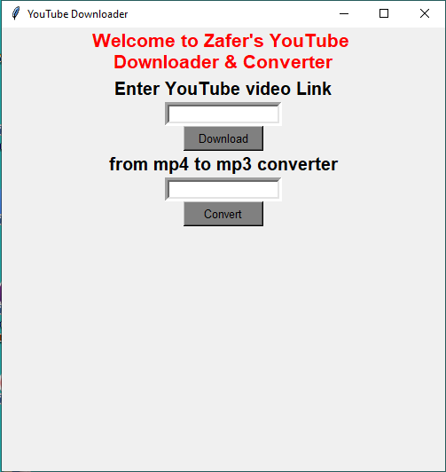

# Creating a YouTube Music Downloader and Converter by using Python

Purpose of the this hands-on training is to give a basic understanding of writing Python application.

## Learning Outcomes

At the end of the this hands-on training, you will be able to;

- understand the basics of application architecture.
  
- have a basic understanding of writing a Python application.

- have a basic understanding of writing and using Python libraries.

- apply knowledge and of building a web application with Python libraries.

- use git repo to manage the application versioning.

## Start With: 

**Let's create a virtual environment:** 
  
- Install `pip3 install virtualenv` 

- open your `virtualenv env` .
  
- activate `source env/bin/activate` "venv".
  
**Then install the tools we need:** 

- Install `pip3 install pytube3`.

- Install `pip3 install -U PyObjC`.
  
- Install `pip3 install moviepy`.

